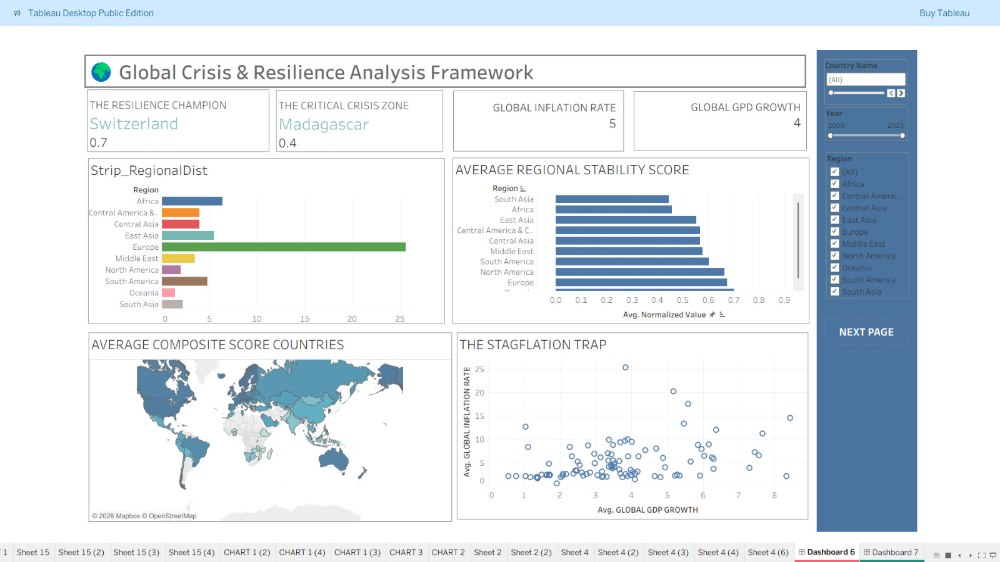

# 📊 Tableau Module | Global Crisis & Resilience Analysis Framework

## Overview

This Tableau module is part of the larger **Global Crisis & Resilience Analysis Framework** project.

The objective of this module is to transform the prepared analytical dataset into interactive dashboards that enable users to explore global resilience, crisis vulnerability, economic stability, healthcare capacity, digital infrastructure, and food security indicators.

The dashboards were designed to support storytelling and provide decision-makers with a clear view of global risks and resilience patterns.

---

## 🎯 Module Objectives

- Visualize resilience and vulnerability indicators.
- Compare regional stability levels.
- Identify countries facing critical conditions.
- Analyze economic and healthcare risks.
- Evaluate digital infrastructure disparities.
- Explore food security and undernourishment patterns.
- Enable interactive exploration through filters and drill-down analysis.

---

# Dashboard 1: Global Overview

This dashboard provides a high-level assessment of global resilience and stability.

## Key KPIs

- Resilience Champion
- Critical Crisis Zone
- Global Inflation Rate
- Global GDP Growth

## Visualizations

- Regional Distribution Analysis
- Average Regional Stability Score
- Global Composite Score Map
- GDP Growth vs Inflation Scatter Plot

### Dashboard Preview

### Key Business Questions

- Which countries demonstrate the highest resilience?
- Which regions show stronger stability levels?
- How does economic growth relate to inflation risk?
- What geographical patterns exist in resilience scores?

---

# Dashboard 2: Risk & Vulnerability Analysis

This dashboard focuses on identifying countries and regions exposed to higher levels of risk.

## Key KPIs

- Current Global Risk Status
- Countries in Critical Conditions
- Electricity Access Rate
- Internet Penetration Rate

## Visualizations

- Stability vs Medical Capacity Trend
- Regional Risk Distribution
- Digital Divide Analysis
- Global Undernourishment Heatmap

### Dashboard Preview

### Key Business Questions

- Which countries are currently in critical conditions?
- How does healthcare capacity influence stability?
- Which regions experience greater digital inequality?
- Where are food security risks concentrated?

---

## 📂 Dataset Domains

The Tableau dashboards analyze indicators across multiple domains:

### Economic Domain
- GDP Growth
- Inflation

### Healthcare Domain
- Medical Capacity
- Health Expenditure
- Physicians & Hospitals

### Digital Infrastructure Domain
- Internet Users
- Broadband Subscriptions
- Electricity Access

### Governance Domain
- Political Stability

### Food Security Domain
- Undernourishment
- Food Dependency Indicators

---

## 🔧 Data Preparation

The dataset used in Tableau was prepared before visualization through:

- Data Cleaning
- Data Transformation
- Data Normalization
- Data Modeling
- KPI Development

The final analytical dataset was then connected to Tableau for dashboard development.

---

## 🛠 Tools Used

- Tableau Public
- Excel
- Power Query

---

## 📈 Business Value

The dashboards help stakeholders:

- Monitor global resilience levels.
- Identify vulnerable regions.
- Evaluate crisis exposure.
- Understand relationships between economic, healthcare, and digital indicators.
- Support data-driven policy and strategic decisions.
