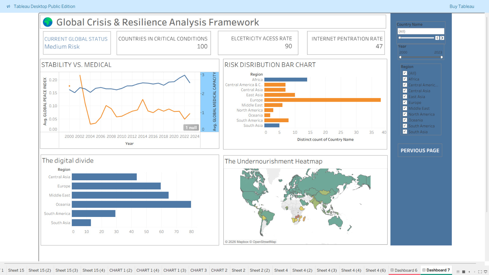
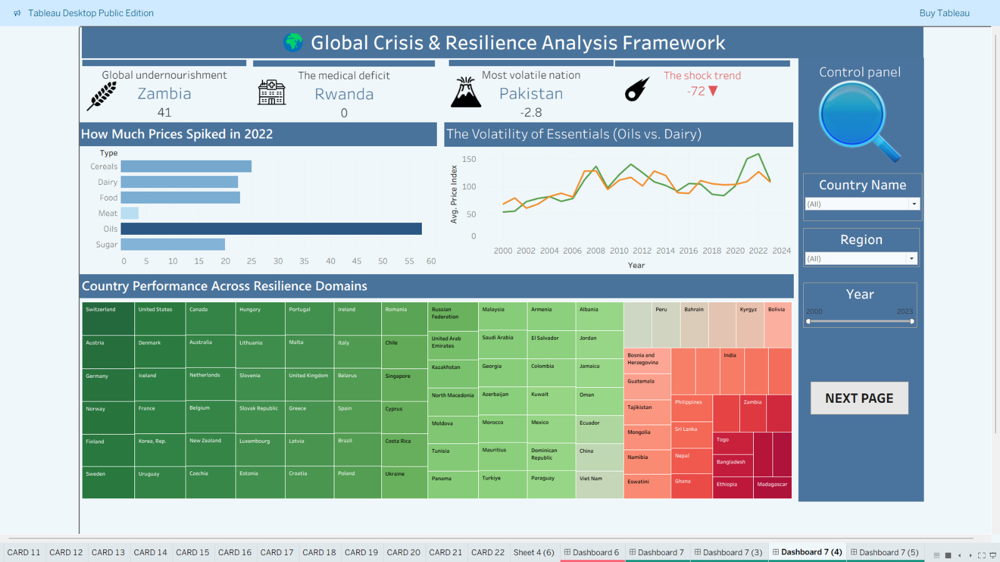
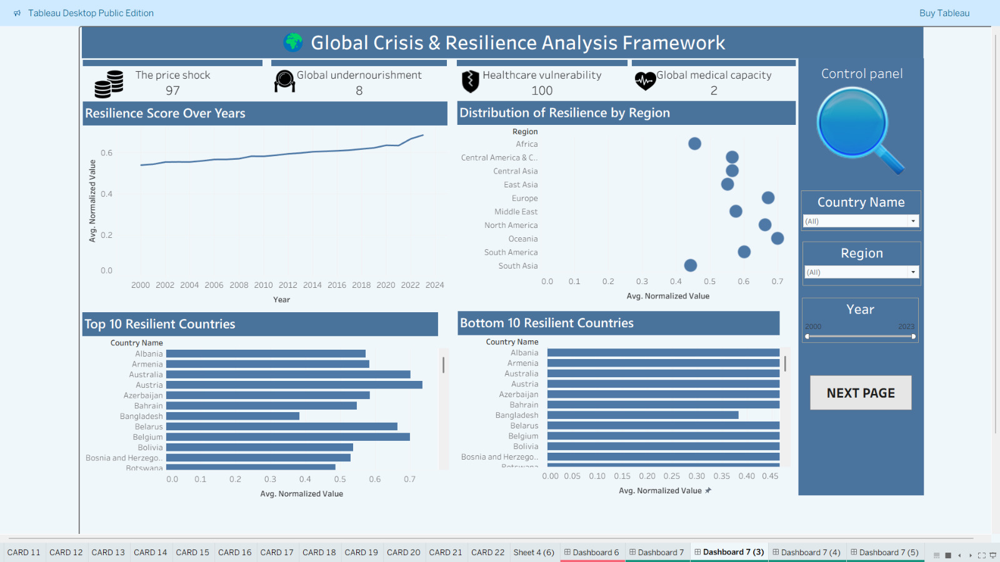
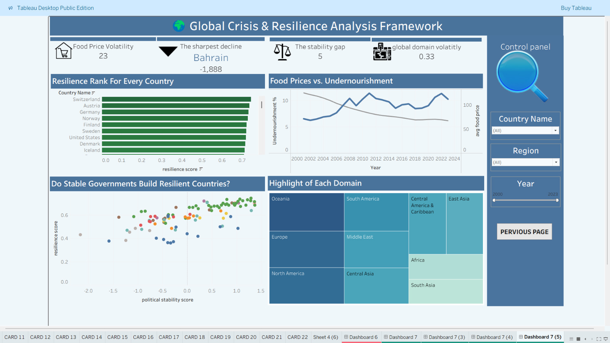

# 📊 Tableau Module | Global Crisis & Resilience Analysis Framework

## Overview

This Tableau module is part of the larger **Global Crisis & Resilience Analysis Framework** project.

The objective of this module is to transform the prepared analytical dataset into interactive dashboards that enable users to explore global resilience, crisis vulnerability, economic stability, healthcare capacity, digital infrastructure, governance, and food security indicators.

The dashboards were designed using a storytelling approach, allowing decision-makers to understand global resilience from multiple perspectives through interactive visual analytics.

---

# 🎯 Module Objectives

- Visualize global resilience and crisis indicators.
- Compare resilience across countries and regions.
- Detect countries facing critical conditions.
- Analyze economic, healthcare, governance, and food security risks.
- Explore digital infrastructure inequalities.
- Understand long-term resilience trends.
- Support interactive exploration using filters and drill-down analysis.

---

# Dashboard 1: Global Overview

This dashboard provides a high-level assessment of global resilience and stability.

## Key KPIs

- Resilience Champion
- Critical Crisis Zone
- Global Inflation Rate
- Global GDP Growth

## Visualizations

- Regional Distribution Analysis
- Average Regional Stability Score
- Global Composite Score Map
- GDP Growth vs. Inflation Scatter Plot

### Dashboard Preview

### Key Business Questions

- Which countries demonstrate the highest resilience?
- Which regions show stronger stability levels?
- How does economic growth relate to inflation risk?
- What geographical patterns exist in resilience scores?

---

# Dashboard 2: Risk & Vulnerability Analysis

This dashboard focuses on identifying countries and regions exposed to higher levels of risk.

## Key KPIs

- Current Global Risk Status
- Countries in Critical Conditions
- Electricity Access Rate
- Internet Penetration Rate

## Visualizations

- Stability vs. Medical Capacity Trend
- Regional Risk Distribution
- Digital Divide Analysis
- Global Undernourishment Heatmap

### Dashboard Preview

### Key Business Questions

- Which countries are currently in critical conditions?
- How does healthcare capacity influence stability?
- Which regions experience greater digital inequality?
- Where are food security risks concentrated?

---

# Dashboard 3: Food Security & Shock Analysis

This dashboard explores the relationship between food prices, healthcare limitations, and resilience under global shocks.

## Key KPIs

- Global Undernourishment
- Medical Deficit
- Most Volatile Nation
- Global Shock Trend

## Visualizations

- Food Price Spike Analysis
- Essential Commodities Volatility
- Country Resilience Treemap
- Food Price Trends

### Dashboard Preview

### Key Business Questions

- Which food categories experienced the largest price increases?
- Which countries are most affected by undernourishment?
- How do food price shocks influence resilience?
- Which countries show the highest overall vulnerability?

---

# Dashboard 4: Resilience Performance Monitoring

This dashboard tracks resilience performance over time and compares countries and regions.

## Key KPIs

- Global Price Shock
- Global Undernourishment
- Healthcare Vulnerability
- Global Medical Capacity

## Visualizations

- Resilience Score Over Time
- Distribution of Resilience by Region
- Top 10 Resilient Countries
- Bottom 10 Resilient Countries

### Dashboard Preview

### Key Business Questions

- How has global resilience changed over time?
- Which regions consistently outperform others?
- Which countries lead the global resilience ranking?
- Which countries require the greatest policy attention?

---

# Dashboard 5: Governance & Domain Insights

This dashboard investigates how governance, food security, and domain performance contribute to national resilience.

## Key KPIs

- Food Price Volatility
- Sharpest Decline
- Stability Gap
- Global Domain Volatility

## Visualizations

- Global Resilience Ranking
- Food Prices vs. Undernourishment
- Political Stability vs. Resilience
- Domain Performance Treemap

### Dashboard Preview

### Key Business Questions

- Does political stability improve national resilience?
- How are food prices associated with undernourishment?
- Which countries rank highest in resilience?
- Which regions perform better across resilience domains?

---

# 📂 Dataset Domains

The Tableau dashboards analyze indicators across multiple domains.

## Economic Domain

- GDP Growth
- Inflation

## Healthcare Domain

- Medical Capacity
- Health Expenditure
- Physicians
- Hospital Capacity

## Digital Infrastructure Domain

- Internet Users
- Broadband Subscriptions
- Electricity Access

## Governance Domain

- Political Stability

## Food Security Domain

- Undernourishment
- Food Price Index
- Food Import Dependency

## Composite Resilience Domain

- Normalized Indicator Scores
- Domain Scores
- Composite Resilience Score
- Risk Classification

---

# 🛠 Tools Used

- Tableau Public
  
---

# 📈 Business Value

The dashboards help stakeholders:

- Monitor global resilience trends.
- Identify vulnerable countries and regions.
- Evaluate economic, healthcare, governance, and food security risks.
- Compare regional resilience performance.
- Detect long-term resilience changes.
- Support evidence-based policy and strategic decision-making.
- Explore global resilience through interactive visual storytelling.
